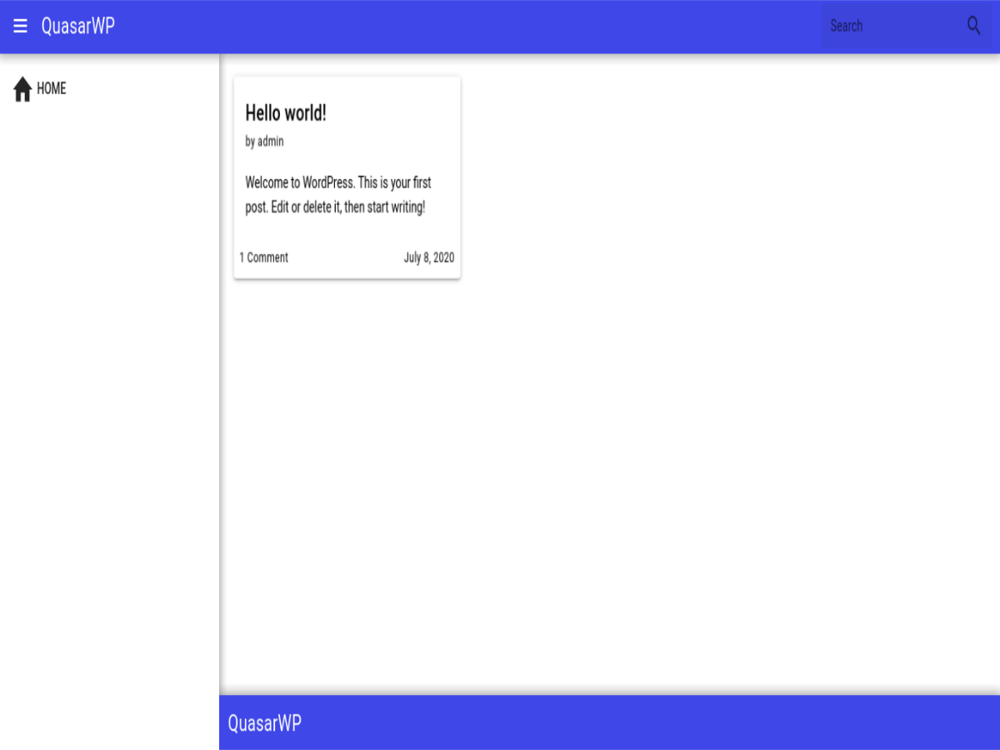

# QuasarWP

> Wordpress theme with Quasar Framework

This is a wordpress theme that has the [Quasar Framework](https://quasar.dev) incorporated with most of its features.

The theme comes with a basic layout, the same way when you install a project using Quasar. 

However, you have a lot of customization settings available to start with.

Besides posting which is inherited by Wordpress, the theme already has some basic blog features, such as sharing buttons and posting comments via dialog.

But a cherry on the cake is that you can include your Vue.js code in your posts and pages as mixins.

Check out more at https://amimaro.github.io/quasarwp.

## Installation

1. Download the [latest release](https://github.com/amimaro/quasarwp/releases/latest).
2. Login to your wp-admin Dashboard.
3. Next, go to the Appearance > Themes page and select Add New button.
4. Then, upload the downloaded package to install the theme.

## Usage example

Check out the project [docs](https://amimaro.github.io/quasarwp) for more information.

## Development setup

You can follow the [installment instructions](#installation) and make your changes at `{WordpressRoot}/wp-content/themes/quasarwp`.

## Contributing

1. Fork it (<https://github.com/amimaro/quasarwp/fork>)
2. Create your feature branch (`git checkout -b feature/fooBar`)
3. Commit your changes (`git commit -am 'Add some fooBar'`)
4. Push to the branch (`git push origin feature/fooBar`)
5. Create a new Pull Request
