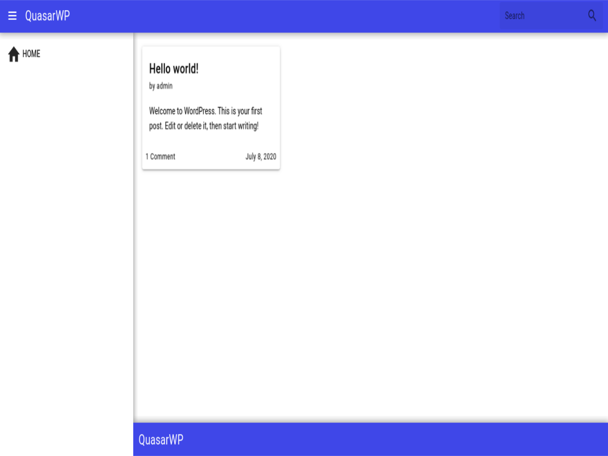

# QuasarWP

> Wordpress theme with Quasar Framework

  

This is a wordpress theme that has the [Quasar Framework](https://quasar.dev) incorporated with most of its features.

The theme comes with a basic layout, the same way when you install a project using Quasar. 

However, you have a lot of customization settings available to start with.

Besides posting which is inherited by Wordpress, the theme already has some basic blog features, such as sharing buttons and posting comments via dialog.

But a cherry on the cake is that you can include your Vue.js code in your posts and pages as mixins.
