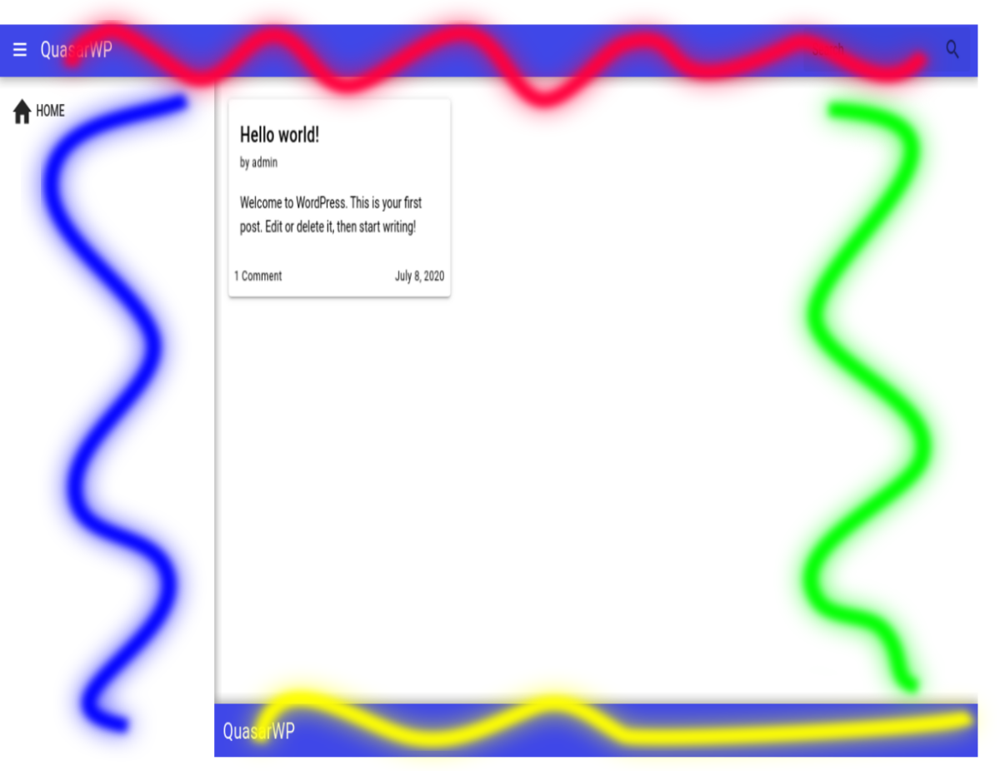
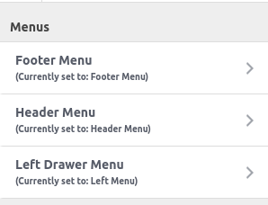
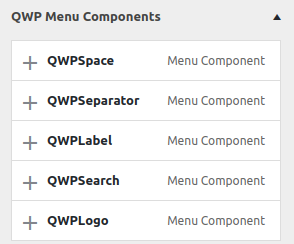

# Menu Components

  

Each color represents a menu section which you can customize what components should be on them.

In the sub-sections there is some of the components which you can include on the marked sections in the image.

  

When the theme is installed, it automatically install the "QuasarWP Components Plugin" which setup a defualt menu just with the header, footer and left-drawer, with some items.

  

Also, the plugin creates some menu items components to customize your project.

[Simple Button](/menu-components/qwp-simple-btn.md) as [Custom Button](/menu-components/qwp-custom-btn.md) are generated by `Custom Link` option.

We will cover each components at the following pages.
