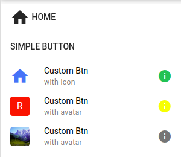

# Custom Button

<p align="center">
  
</p>

It works the same way as the [Simple Button](/menu-components/qwp-simple-btn.md), but instead the link text label be the button name, it is a `JSON` object with some properties defining our button.

This menu item can create both an [Icon](https://quasar.dev/vue-components/icon) and an [Avatar](https://quasar.dev/vue-components/avatar) Quasar Component.

Bellow we have three `JSON` that represents the buttons in the image.

## Icon

```
{
  "title": "Custom Btn",
  "icon": {
    "name": "home",
    "size": "md",
    "color": "blue"
  },
  "caption": "with icon",
  "target": "blank",
  "sideIcon": {
    "name": "info",
    "color": "green"
  }
}
```

## Avatar

```
{
  "title": "Custom Btn",
  "avatar": {
    "content": "R",
    "rounded": "true",
    "size": "md",
    "color": "red",
    "textColor": "white"
  },
  "caption": "with avatar",
  "target": "blank",
  "sideIcon": {
    "name": "info",
    "color": "yellow"
  }
}
```

This example has a rounded border square and a text content.

```
{
  "title": "Custom Btn",
  "avatar": {
    "img": "https://cdn.quasar.dev/img/mountains.jpg",
    "rounded": "true",
    "size": "md",
    "color": "red",
    "textColor": "white"
  },
  "caption": "with avatar",
  "target": "blank",
  "sideIcon": {
    "name": "info"
  }
}
```

This example has an image places at the left.
