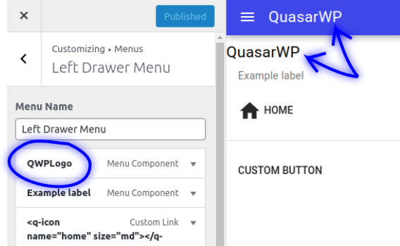
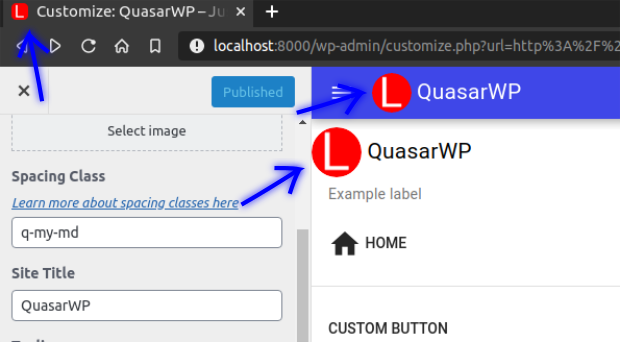
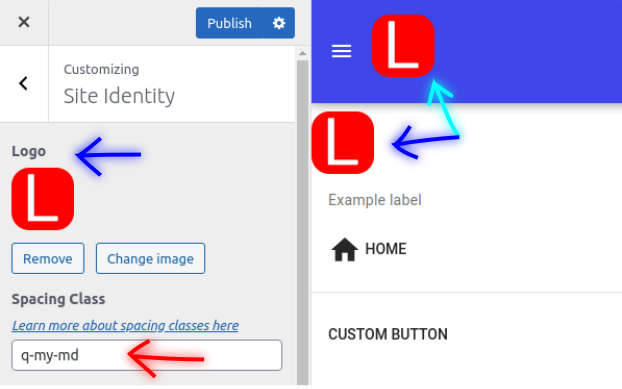

# Logo

  

By default, the Logo menu item shows the blog name and the blog icon if it exists.

  

If the icon is set, it will show right next to the blog name.

This options can be configured at `Site Identity` menu at the theme Appearance customization dashboard.

  

Still at `Site Identity`, you can add a logo which will replace the blog name.

To better stylling Quasar has some css helpers classes to set the spacing around the logo.

[Click here](https://quasar.dev/style/spacing) to learn more about css spacing classes.
