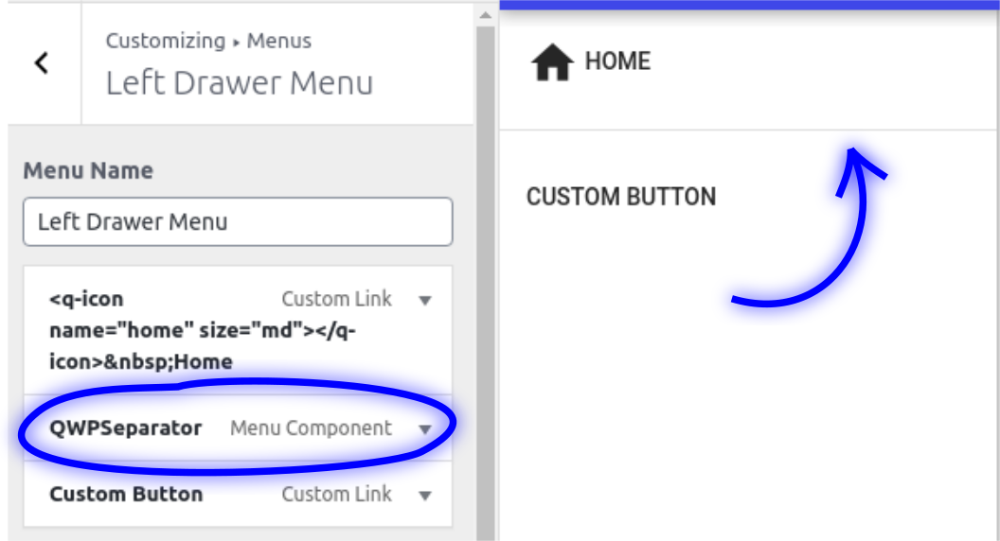

# Separator

  

Select the separator from Menu Items at [QWP Menu Components](/menu-components/).

It automatically detects if it should be a verticar separator, in case of the drawers or, a horizontal separator, in case of the header and the footer.
