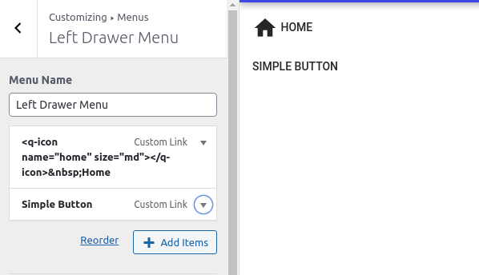

# Simple Button

  

It's the simplest button action you can include in those menus.

Just create a `Custom Link` with a name and url.

If you like to include an icon with the name you can add the following tag.

`<q-icon name="{iconName}" size="{iconSize}"></q-icon>` (don't forget to close the tag)

[Material Icons](https://material.io/resources/icons/?style=baseline) is the defaul icon library but you can change it at `QuasarWP Settings` menu at `Dashboard > Appearance`.

Also, there are other attributes which you can include with your icon.

Check out [Quasar's Icon docs](https://quasar.dev/vue-components/icon) to find ou more customization settings.
