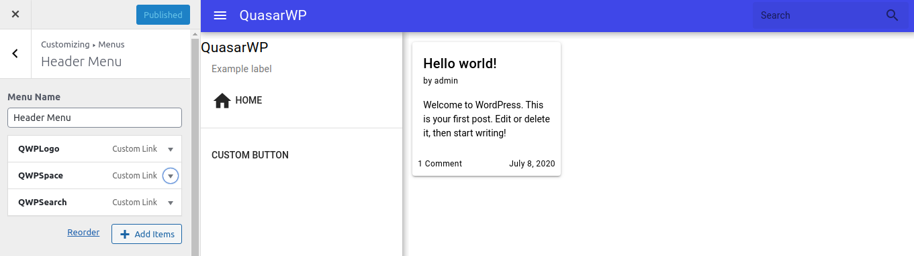
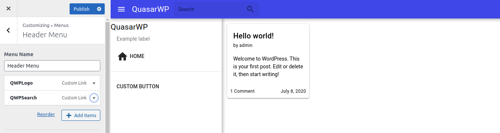
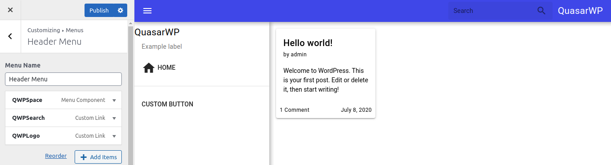

# Space

  

The Space components helps to create gaps between components and arranging them at the navigations bars.

Above we have an example where a space is between the logo and the search input.

  

And here is an example without the space.

Both stays next to each other.

  

If you want to align every the components to the right, position a space at the begginng.
