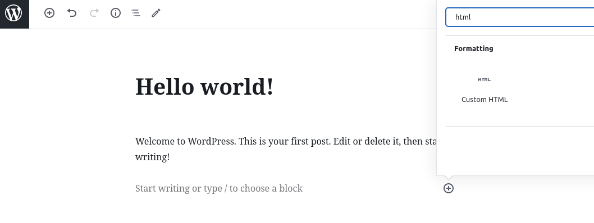
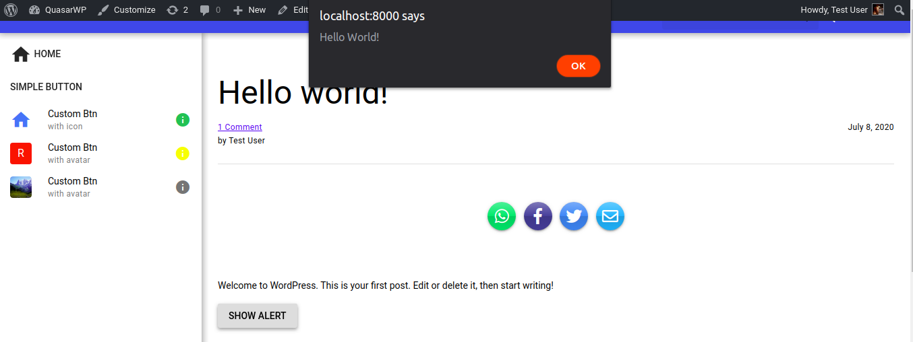
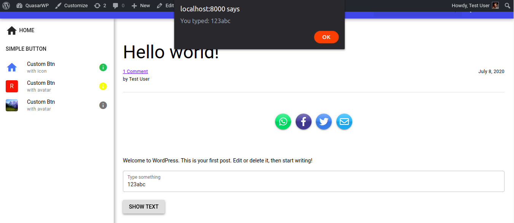

# "Mix in" Some Code

Perhaps this is one of the greatest differentials of this theme and what motivated me to create it.

I like Vue.js and Quasar Framework and wanted a quick way to create blog-style posts and pages, in that I know that Wordpress has several tools to facilitate it.

But I feel that there is a limitation in creating more interactive pages, with a different layout and interactive forms without relying on several plugins.

Typically, you can include your javascript code on a wordpress page or post using the code editor.

In fact, you can use the tags of the components of the quasar framework normally.

However, if you want to include some properties in the Vue.js component instance you can include them using [mixins](https://vuejs.org/v2/guide/mixins.html).

Next I will show how we can include an example script.

And of course, this methos was the most viable one I found at the time. Contributions and new ideas are very welcome.

## Example Scripts

Important: include all your mixins properties at `const vm = {}`. At the end of the script, the Vue object include `vm` as mixins value before creating a new Vue instance. 

1. First, edit any post or create a new one.
2. Create a new block and select Custom HTML.
<p align="center">
  
</p>

3. Copy and paste one of the example scripts bellow

 - Show Alert Example
```
<q-btn label="Show Alert" @click="showAlert"></q-btn>
<script>
const vm = {
  methods: {
    showAlert() {
      alert('Hello World!');
    }
  }
}
</script>
```

You should see the following result:

<p align="center">
  
</p>

 - Show typed text example
```
<q-input outlined focus v-model="text" label="Type something"></q-input>
<br>
<q-btn label="Show Text" @click="showText"></q-btn>
<script>
const vm = {
  data() {
    return {
      text: null
    }
  },
  methods: {
    showText() {
      if (!this.text) {
        alert('Please, type something');
        return
      }
      alert('You typed: ' + this.text);
    }
  }
}
</script>
```

You should see the following result:

<p align="center">
  
</p>
